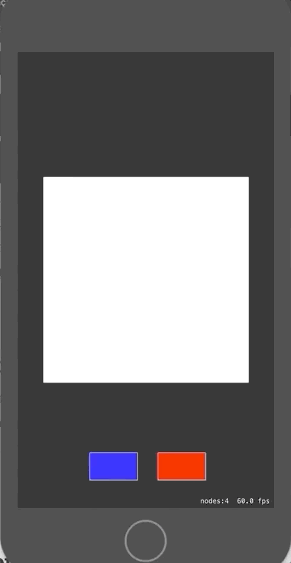
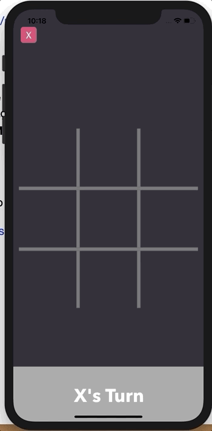
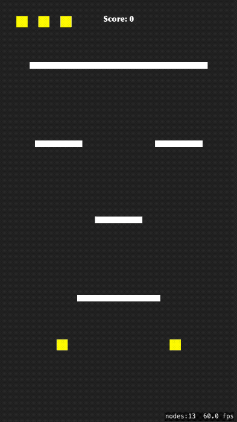

# TechDemos

## Angry Birds

Essa TechDemo tem com objetivo recriar a física do jogo angry birds. Nela, foi aborado aspectos como: **Lançamento oblíquo**, **gravidade**, **trigonometria** e  **Câmera**. O resultado obtido é seguinte: 

## Mural De Herois

Essa TechDemo tem com objetivo explorar o máximo possível da SKCameraNode. Nele, conseguimos explocar uma forma sólida de criar um objeto dessa classe e como criar, por exemplo, **Zoom in/out** e **Navegação por swipe**. O resultado obtido é seguinte: 

Os links para os posts explicando a criação dessa ferramenta podem ser encontados aqui:

[SKCameraNode- Uma abordagem Sólida, Parte - 1](https://medium.com/@levycristian/skcameranode-uma-abordagem-s%C3%B3lida-parte-1-10f47a0be99c) \
[SKCameraNode- Uma abordagem Sólida, Parte - 2](https://medium.com/@levycristian/skcameranode-uma-abordagem-s%C3%B3lida-parte-2-c4eb93c8ec91) \
[SKCameraNode- Uma abordagem Sólida, Parte - 3](https://medium.com/@levycristian/skcameranode-uma-abordagem-s%C3%B3lida-parte-3-3c05f8d59afa)

## Sound Platform
Essa techdemo tem como objetivo explorar alguns recursos do SpriteKit como adicionar blocos dinamicamente na tela, explorar recursos de áudio, checar contato entre dois objetos e remover itens da cena.

links dos posts: \
[Tech Demo de SpriteKit programaticamente falando [Parte I]](https://medium.com/p/555e3414fbde) \
[Tech Demo de SpriteKit programaticamente falando [Parte I]](https://medium.com/@alcidesjuniorbr/124663e32ef0)

## Como criar botões e adicionar ação usando SpriteKit
Essa techdemo tem como objetivo ensinar como criar um botão e adicionar uma ação qualquer a ele.

 \
link do post: \
[Como criar um botão usando SpriteKit](https://medium.com/p/1394efab5211)

## Jogo da Velha (Tic-Tac-Toe)

Essa TechDemo tem como objetivo explorar os conceitos de inteligencia artificial que o framework GamePlayKit aborda, introduzidos no famoso jogo da velha. Nele veremos a utilização do **Minmax Strategist**, os protocolos **GKGameModel**, **GKGameModelPalyer**, **GKGameModelUpdate** e muito mais! 😁

Um post foi criado para ajudá-lo a entender o funcionamento dos protocolos:

[GamePlayKit: Entendendo o protocolo GKGameModel](https://medium.com/academy-ifce/gameplaykit-entendendo-o-protocolo-gkgamemodel-f4df2b2f031d) 

## 3DTouchGame

Essa TechDemo foi criada inspirada no jogo Dividr um jogo de mecânica bem simples porém muito viciante, vale ressaltar que todas as linhas do código estão comentadas para facilitar o seu aprendizado, a tecnologia utilizada para desenvolvimento foi SpriteKit o framework para jogos 2D da Apple.

## FlyingFish

Essa TechDemo foi criada inspirada no jogo Flap Bird um jogo bastante conhecido pela comunidade, vale ressaltar que todas as linhas do código estão comentadas para facilitar o seu aprendizado, a tecnologia utilizada para desenvolvimento foi SpriteKit .

Se for a sua primeira vez com a tecnologia preparei uns posts para ajudar seu processo de familiarização com a engine que te darão embasamento para conceitos mais complexos.

[Primeiros passos com SpriteKit](https://medium.com/academy-ifce/gameplaykit-entendendo-o-protocolo-gkgamemodel-f4df2b2f031d) 
[Animação com frames utilizando SpriteKit](https://medium.com/academy-ifce/gameplaykit-entendendo-o-protocolo-gkgamemodel-f4df2b2f031d) 
